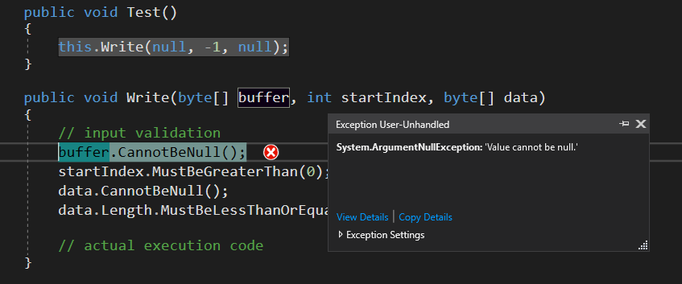

# Defensive programming framework for .NET Framework

Defensive programing is a programming style that practices thorough validation of method input parameters resulting in robust code that allows method execution only in case of valid input or terminates it otherwise. 

Despite the benefits most software developers choose to skip this step, since it requires extra time and effort to validate input, inflates code and makes methods harder to understand and more difficult to maintain.

Example:
```csharp
public void Write(byte[] buffer, int startIndex, byte[] data)
{
    //  input validation
    if (buffer == null)
    {
        throw new ArgumentException("Value cannot be null.");
    }

    if (startIndex < 0)
    {
        throw new ArgumentException("Value cannot be less than 0.");
    }

    if (data == null)
    {
        throw new ArgumentException("Value cannot be null.");
    }

    if (data.Length >= buffer.Length - startIndex)
    {
        throw new ArgumentException($"Length cannot be greater than {buffer.Length - startIndex}.");
    }

    // actual execution code
    ...
}
```
Input validation can take a large portion of the method and should be reduced if possible.  Such code is repeated in most methods over and over again with slight variations.

 This is where defensive programming framework helps out with a set of extension methods that allow a short and simple way to validate input.

Previous example using the defensive programming framework:
```csharp
public void Write(byte[] buffer, int startIndex, byte[] data)
{
    // input validation
    buffer.CannotBeNull(); // throws new ArgumentException if buffer == null
    startIndex.MustBeGreaterThanOrEqualTo(0); // throws new ArgumentException if startIndex <= 0
    data.CannotBeNull(); // thorws new ArgumentException if data == null
    data.Length.MustBeLessThanOrEqualTo(buffer.Length - startIndex); // throws new ArgumentException if data.Length > buffer.Length - startIndex

    // actual execution code
    ...
}
```
When one of the conditions fails, method execution will terminate by throwing an ArgumentException at the location where the validation method is called.



 A different way of validation would allow us to continue execution in some cases by correcting some of the input instead. This approach might not always be possible.

Example:
```csharp
public void Write(byte[] buffer, int startIndex, byte[] data)
{
    // input validation
    buffer.CannotBeNull();
    startIndex = startIndex.WhenIsLessThan(0, 0); // returns 0 if startIndex < 0
    data = data.WhenIsNull(new byte[0]); // returns empty byte array if data == null
    data.Length.MustBeLessThanOrEqualTo(buffer.Length - startIndex);

    // actual execution code
}
```
As evident from the examples method input validation with defensive programming framework is shorter and clearer than the original one. 

## Validation types
Validation can be either **unconditional** and **optional**.

## Unconditional validation
Failing unconditional validation results in termination of execution by throwing an ArgumentException. There are two forms of unconditional validation: conditions that must result in true and conditions that cannot result in true. 

### Must conditions
Must conditions specify that the result of the condition must be valid or true, otherwise execution will terminate.

Examples:
 - value must be equal to a specified value,
 - value must match a specified regular expression,
 - value must be greater than or equal to a specified limit,
 -  evaluated function must result in true.

```csharp
minValue.MustBeEqualTo(3);
text.MustMatch(new Regex("^[0-9]+$"));
index.MustBeGreaterThanOrEqualTo(100);
filePath.MustBe(x => File.Exists(x));
filePath.MustBeValidFilePath();
directoryPath.MustBeAbsoluteDirectoryPath();
file.MustFileExist();
```
### Cannot conditions
Cannot conditions specify that the result of the condition must be invalid or false, otherwise execution will terminate.

Example:
 - value cannot be null,
- collection cannot be empty,
-  collection cannot contain null values,
- collection cannot contain duplicates,
- value cannot be belong to a predefined list of values,
-  file path cannot contain invalid characters.

```csharp
url.CannotBeNull();
collection.CannotBeEmpty(); // does not throw ArgumentException if null, only if empty
items.CannotContainNull();
list.CannotContainDuplicates();
text.CannotBeOneOf("a", "b", "c");
filePath.CannotBe(x => filePath.Intersect(Path.GetInvalidFileNameChars()).Any());
```
## Optional validation
Optional validation allows for invalid input to be substituted with a valid one when not conforming to the limitations specified. There are two forms of optional validation: when a result of a condition is true and when a result of a condition is false.

### When conditions
When conditions allow to substitute current value with a default one value when the result of evaluation is true.

Example:
 - when value is between specified limits, substitute it with a default value,
 - when value is contains duplicates, substitute it with distinct values,
 - when a collection contains a null value, return same collection without null items.

```csharp
number = number.WhenIsBetween(int.MinValue, 0, true, 0);
collection = collection.WhenContainsDuplicates(collection.Distinct().ToList());
lines = lines.WhenContainsNull(lines.Where(x => x != null).ToList());
```
### When not conditions
When not conditions allow to substitute current value with a default one value when the result of evaluation is false.

Example:
 - when a string is not trimmed, substitute it with  a trimmed string,
 - when value does not match a specified regular expression, substitute it with a default value,
 - when a value does not belong a predefined set of values, substitute it with a default value.

```csharp
path = path.WhenIsNot(x => x.Trim() == x, path.Trim());
text = text.WhenDoesNotMatch(new Regex("^[0-9]$"), "0");
letter = letter.WhenIsNotOneOf(new string[] { "a", "b", "c" }, "a");
filePath.WhenIsNotAbsoluteFilePath(Path.GetFullPath(filePath));
```
## Combining conditions
Conditions can be chained together:
 
 ```csharp
filePath = filePath.CannotBeNullOrEmpty() // file path must be specified
                    .CannotBe(x => filePath.Intersect(Path.GetInvalidFileNameChars()).Any()) // file path must be a valid
                    .MustBe(x => File.Exists(x)) // file must exist
                    .MustBe(x => Path.GetExtension(x) == ".pdf") // file must be a PDF file
	                .WhenIs(x => Path.GetFullPath(x) != x, Path.GetFullPath(filePath)); // convert file path to an absolute file path

// now you can be certain that everyting is in order
```

## Utility methods

For checking a certain condition you have the option of using affirmative or negative utility extension methods:
```csharp
if(input.IsNotNullOrEmpty())
{
}

if(input.ContainsDuplicates())
{
}
```

## Conditional validation
Sometimes you want to perform validation under a certain condition. In this case you can use *Then* method to perform conditional validation. The content of Then method will be executed  only if the preceding condition equals to true.

Example:
 - if value A isn't be null, then value B can't be null
 - if value A is greater than value B, then value B must be greater than value C

```csharp
input.IsNotNull().Then(() => output.CannotBeNull);
a.IsGreaterThan(b).Then(() => b.MustBeGreaterThan(c));
url.IsNotNull().Then(() => port.MustBeBetween(IPEndPoint.MinPort, IPEndPoint.MaxPort));
url.StartsWith("http").Then(() => port.MustEqual(443));
```


## Naming convention
All validation methods exist in must, cannot, when, when not, affirmative and negative combination and follow the following naming convention:

 - Must methods start with "Must",
 - Cannot methods start with "Cannot",
 - When methods start with "When",
 - When not methods start with "When + Condition + Not",
 - Affirmative utility methods start "Is", "Does" or "Contains",
 - Negative utility methods start with "IsNot", "DoesNot" or "ContainsNot".

# Installation
Run the following command in your Package Manager Console in Visual Studio:
```csharp
Install-Package DefensiveProgrammingFramework 
```
Or just simply search for DefensiveProgrammingFramework in NuGet package manager in Visual Studio.

# Usage
Simply include the DefensiveProgrammingFramework namespace in the source file and you'll be able to use the extension methods.   
```csharp
using DefensiveProgrammingFramework;
```

# Guidelines
 - It it recommended that you perform input validation in every method of your application. Doing so will make discovering bugs faster and easier since you will be able to catch errors at their source and not somewhere down the line.
- It it recommended that you perform input validation at the very beginning of the method. Performing validation after a part of the method has already executed will make issues harder to pinpoint since parameter values might have changed by the time an ArgumentException has been thrown.
 - Depending on the situation you need to choose between unconditional validation and optional validation or the combination of the two. In case a method can recover from invalid input use optional validation; otherwise use unconditional validation.
 - Validation methods are thread safe.
 - Early returns by returning nothing at all is not possible with Defensive Programming Framework since it is considered a bad practice by terminating method execution without providing feedback and should be avoided.

